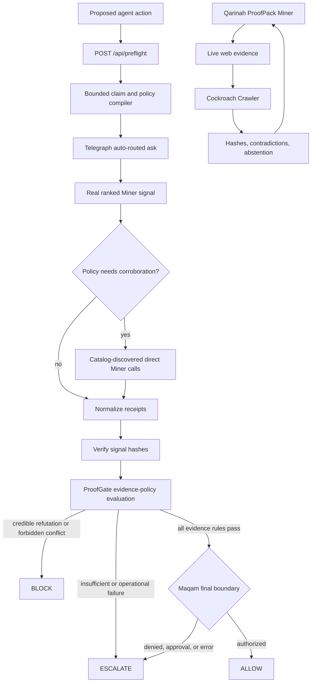

# ProofGate

**No proof. No action.**

[](https://github.com/AjnasNB/qarinah-proofpack/actions/workflows/ci.yml)
[](LICENSE)
[](https://devnode.telegraphprotocol.com/api/miners/398)
[](docs/PROOFGATE-TRACK3.md)
[](telegraph/miner.yaml)

[**Live ProofGate**](https://qarinah-proofpack.vercel.app/) ·
[**ProofPack Miner**](https://qarinah-proofpack.vercel.app/proofpack) ·
[**ProofPack verifier**](https://qarinah-proofpack.vercel.app/verify) ·
[**API health**](https://qarinah-proofpack.vercel.app/health) ·
[**Track 3 runbook**](docs/PROOFGATE-TRACK3.md) ·
[**Miner runbook**](docs/TELEGRAPH-SUBMISSION.md)

## What we are building

ProofGate is a **pre-action evidence firewall for autonomous agents**. It is not
another fact-check chatbot. Before an agent publishes a claim, executes a
workflow, approves a transaction, or performs another consequential action,
ProofGate makes the agent earn permission with verifiable intelligence.

The agent supplies the proposed action and a plain-English evidence policy.
ProofGate asks real Telegraph Miners for intelligence, verifies the returned
signals, evaluates independent agreement and conflict, preserves the decision
provenance with Qarinah, and sends the exact action through Maqam's final
authorization boundary.

The result is deliberately small and machine-actionable:

| Decision | Meaning |
|---|---|
| `ALLOW` | Verified evidence satisfies every declared policy rule, so the exact action may proceed |
| `BLOCK` | Credible verified evidence refutes the action, or the policy explicitly forbids the detected conflict |
| `ESCALATE` | Evidence, confidence, Miner diversity, policy coverage, payment, or verification is insufficient; require human review |

In one sentence: **Telegraph decides which intelligence providers deserve the
request; ProofGate decides whether their verified evidence is strong enough for
an agent to act.**

## Two connected Telegraph submissions

| Component | Track | Role |
|---|---|---|
| **Qarinah ProofPack** | Supporting **Track 1 Miner** | Produces structured, hash-verifiable evidence packs for `FACT_CHECK` and `RESEARCH_SYNTHESIS` |
| **Qarinah ProofGate** | Primary **Track 3 Application** | Consumes real Telegraph Miner signals and returns the pre-action `ALLOW`, `BLOCK`, or `ESCALATE` decision |

These are two sides of the same trust system. ProofPack supplies verifiable
intelligence to Telegraph; ProofGate creates real application demand for
Telegraph intelligence and uses it at an actual authorization boundary.

## A simple example

Suppose an autonomous publishing agent wants to post: "Company X will launch
Product Y this month."

1. The agent sends that action and its evidence policy to `POST /api/preflight`.
2. Telegraph routes a paid request to a real ranked Miner.
3. ProofGate obtains distinct second opinions when the policy requires them.
4. Every counted response must resolve to a verifiable Telegraph `signal_hash`.
5. Qarinah seals Miner identity, result hashes, payment-receipt hashes, policy
   evaluation, and event relationships into a downloadable receipt.
6. Maqam checks the final action boundary.
7. ProofGate returns `ALLOW`, `BLOCK`, or `ESCALATE`. Weak or conflicting
   evidence never becomes permission by default.

Production never substitutes local or mocked intelligence. Missing wallet
configuration, payment failure, unavailable Telegraph service, insufficient
mapped-confidence corroboration, ambiguous policy, or insufficient distinct
Miners can only reduce authority to `ESCALATE`.

## Why this fits Track 3

Telegraph's Application Track asks builders to ship real products, agents,
automations, and workflows that consume live Miners and create genuine demand.
ProofGate puts Telegraph in the critical path of an autonomous decision instead
of using it as a decorative data source:

- it uses Telegraph's auto-routing path before requesting justified independent
  corroboration;
- it consumes real, x402-paid Miner responses rather than fixtures;
- it verifies and retains the returned `signal_hash` commitments;
- it applies declared confidence thresholds, Miner diversity, conflict, and
  policy rules before authorizing an action;
- it demonstrates useful safe behavior when the correct answer is to refuse or
  escalate, not merely when Miners agree;
- every real preflight generates measurable demand for Telegraph Miners.

The competitive demonstration is three cases: a supported claim that earns
`ALLOW`, a credibly refuted claim that produces `BLOCK`, and an ambiguous or
conflicted claim that safely produces `ESCALATE`. Real paid calls, retained
signal proofs, genuine users or agent integrations, and transparent public
updates are the adoption evidence—not mocked traffic or a scripted result.

See the [official Telegraph rules](https://hackathon.telegraphprotocol.com/rules)
and the complete [Track 3 runbook](docs/PROOFGATE-TRACK3.md).

> [!NOTE]
> Qarinah ProofPack is an active supporting Track 1 Miner and is available at `/proofpack`. Telegraph's live catalog resolves YAML Miner ID `717190`, slug `qarinah-proofpack`, and on-chain registration `398`; the Track 1 portal separately reports the entry as verified. This repository never describes a direct `/v1/proof` call as Track 3 usage; qualifying usage goes through Telegraph Engine and preserves a real `signal_hash`.

> [!WARNING]
> The deployed ProofGate payer is not configured yet, so a funded end-to-end Track 3 run has not been evidenced. Until a dedicated, minimally funded Base Sepolia burner returns retained verified receipts, `ESCALATE` is the only evidenced production outcome; `ALLOW` and `BLOCK` remain tested contract behavior, not live-demo claims.

## ProofGate preflight contract

```http
POST /api/preflight
Content-Type: application/json

{
  "action": "Publish the claim: The James Webb Space Telescope launched in 2021.",
  "policy": "Allow only when mapped provider confidence is at least 80%, at least two independent Miners support the claim, and there is no material conflict. Otherwise escalate to human review."
}
```

The response conforms to [`proofgate.preflight.v1`](schemas/proofgate.preflight.v1.schema.json) and contains:

| Field | Meaning |
|---|---|
| `decision` | `ALLOW`, `BLOCK`, or `ESCALATE` |
| `authorization_issued` | `true` only when every hard rule passes with verified real Telegraph receipts |
| `claims[]` | Extracted claim assessments and signal links |
| `compiled_policy` | Parsed thresholds, recognized constraints, unsupported clauses, and policy hash |
| `aggregate` | Mean catalog-mapped confidence from distinct Miners aligned with the dominant stance, unique Miner count, verified signals, conflicts, and paid cost |
| `rules[]` | Rule-by-rule ProofGate evidence-policy evaluation, including the final Maqam boundary |
| `signals[]` | Miner ID, route mode, intent, route rank, provider confidence if present, `signal_hash`, and result hash |
| `qarinah` | Hash-linked preflight event chain |
| `receipt` | Canonical SHA-256 receipt root and signal commitments |

Telegraph does not expose one universal network confidence or one consensus endpoint. ProofGate uses provider confidence only when the selected Miner's declared signal mapping supplies it, reports the mean from distinct Miners aligned with the dominant stance, and requires enough aligned Miners to meet the confidence-coverage rule. Uncertain or opposing signals can never raise the confidence used to authorize that stance. A coincidental undeclared number has no policy authority. Distinct corroboration counts unique `miner_id` values rather than raw call count.

## ProofPack evidence engine

Qarinah ProofPack is a standalone [Telegraph](https://telegraphprotocol.com/) Miner and web application. It takes a factual claim or research question, gathers live public evidence, and returns a sealed machine contract with:

- a `SUPPORTED`, `REFUTED`, `MIXED`, or `INSUFFICIENT_EVIDENCE` verdict;
- calculated confidence and its complete component breakdown;
- supporting, refuting, neutral, and contradictory evidence records;
- canonical source URLs, retrieval times, and SHA-256 content hashes;
- a hash-linked, in-memory Qarinah evidence-event chain;
- a Maqam evidence-policy decision and explicit abstention;
- an offline-checkable manifest seal that can be compared with a trusted commitment.

The differentiator is not a claim that our language model is smarter. ProofPack knows when the available evidence is too weak for an autonomous system to act.

> [!IMPORTANT]
> Self-verification proves internal consistency: the payload matches its embedded manifest, evidence records match their hashes, and the Qarinah chain is continuous. It does not authenticate the issuer, because anyone can recompute an untrusted self-contained hash. Compare `verification.manifest_hash` with a trusted Telegraph/on-chain commitment to detect replacement or resealing. No hash can prove that a source is truthful; source quality, diversity, relevance, agreement, and the Maqam policy determine whether the pack authorizes a decisive verdict.

## Why this is Telegraph-native

Telegraph is in the live authorization loop, not added as a badge or an optional data source. ProofGate first uses `POST /engine/v1/ask` so Telegraph can classify the request and select a ranked Miner. It then uses catalog-discovered direct calls only when an action policy needs distinct second opinions. Every successful call is x402-paid and preserved by its real `signal_hash`.

Telegraph answers: **which intelligence provider should receive this request?**

Qarinah answers: **what evidence and provenance produced this decision?**

ProofGate answers: **does the evidence satisfy the declared thresholds?**

Maqam answers: **may the exact tool action cross the final authorization boundary?**

ProofGate returns the authorization boundary.

The supporting ProofPack Miner also exposes structured semantics:

```yaml
semantics:
  signal_mapping:
    confidence_field: confidence
    label_field: verdict
    reason_field: reason
  supported_intents:
    - FACT_CHECK
    - RESEARCH_SYNTHESIS
```

## System architecture



The ProofGate path is fail-closed:

1. No client can choose a Miner ID, upstream endpoint, payment recipient, or price.
2. The server reads the active Miner catalog and x402 challenge at request time.
3. One auto-routed call demonstrates Telegraph's ranking path; at most two justified second-opinion calls may follow.
4. Duplicate Miner IDs never count as independent corroboration.
5. A response must have a real `signal_hash`, and an `ALLOW` requires verified receipts.
6. Qarinah seals the action, policy, signals, evidence decision, and final Maqam boundary result into an isolated in-memory event chain.
7. Unsupported policy language, incomplete signals, payment errors, and timeouts produce `ESCALATE`.

The supporting ProofPack path is static-first and fail-closed:

1. Maqam governs anonymous Exa discovery with a bounded DuckDuckGo fallback.
2. Cockroach Crawler fetches only validated public HTTP(S) URLs with explicit origins, robots compliance, SSRF defenses, byte limits, request limits, and time budgets.
3. An optional external Cockroach Browser sidecar can render at most two eligible JavaScript failures. It is never bundled into this Apache-2.0 service.
4. Passage extraction, stance classification, and scoring are deterministic.
5. Maqam blocks decisive output when evidence fails the contract.
6. Optional LLM synthesis may make the answer easier to read. It cannot change the verdict or confidence.
7. Qarinah creates a new isolated event chain in memory. No upstream workspace ledger is discovered, read, or modified.
8. The service seals the complete payload and verifies it before returning HTTP 200.
9. If live acquisition is unavailable, the endpoint returns a valid sealed abstention pack instead of inventing an answer.

## Evidence contract

Confidence is calculated, never improvised by the synthesizer:

```text
confidence =
  0.35 × entailment
+ 0.20 × source diversity
+ 0.20 × evidence coverage
+ 0.15 × freshness
+ 0.10 × source agreement
```

The default Maqam policy applies these gates:

```text
coverage < 0.50              -> abstain
confidence < 0.55            -> abstain
independent sources < 2      -> abstain
material credible conflict   -> MIXED and abstain
insufficient decisive margin -> abstain
```

Single-source evidence also receives a confidence penalty before policy evaluation.

## API

### Create a proof

```http
POST /v1/proof
Content-Type: application/json

{
  "query": "Did the James Webb Space Telescope launch in 2021?",
  "intent": "FACT_CHECK",
  "request_id": "demo-jwst-001"
}
```

Only `query` is required. `query` accepts 3 to 2,048 normalized characters. The request schema is closed, so unknown fields are rejected.

Run it locally:

```bash
curl --request POST http://localhost:3000/v1/proof \
  --header "Content-Type: application/json" \
  --data '{"query":"Did the James Webb Space Telescope launch in 2021?","intent":"FACT_CHECK"}'
```

The complete response conforms to [`schemas/proofpack.v1.schema.json`](schemas/proofpack.v1.schema.json). Useful top-level fields include:

| Field | Meaning |
|---|---|
| `verdict` | Final evidence-policy label |
| `confidence` | Calculated score from 0 through 1 |
| `answer` | Concise synthesis constrained by the verdict |
| `coverage_score` | Fraction of material claim terms covered by relevant evidence |
| `freshness_score` | Evidence freshness weighted by relevance and quality |
| `conflict_score` | Strength of simultaneous support and refutation |
| `claims[]` | Claim-to-evidence links |
| `evidence[]` | Untrusted source passages, stances, quality signals, and hashes |
| `contradictions[]` | Explicit unresolved evidence conflicts |
| `policy` | Maqam thresholds, triggered rules, and decision |
| `qarinah` | Embedded evidence-event chain and head hash |
| `verification` | Manifest seal and chain metadata |
| `abstained` | Whether policy blocked a decisive answer |
| `reason` | Machine-readable signal reason mapped for Telegraph |

Inspect a compact view with `jq`:

```bash
curl --silent --request POST http://localhost:3000/v1/proof \
  --header "Content-Type: application/json" \
  --data '{"query":"Was Python first released in 1991?"}' \
  | jq '{verdict, confidence, coverage_score, freshness_score, conflict_score, abstained, reason, evidence_count: (.evidence | length), manifest_hash: .verification.manifest_hash}'
```

### Verify a pack

`POST /v1/verify` performs bounded closed-contract validation, evidence-hash checks, embedded-manifest consistency checks, event validation, Qarinah continuity checks, reference checks, and policy-invariant checks without network access.

```bash
curl --silent --request POST http://localhost:3000/v1/proof \
  --header "Content-Type: application/json" \
  --data '{"query":"Was Python first released in 1991?"}' \
  --output proofpack.json

curl --request POST http://localhost:3000/v1/verify \
  --header "Content-Type: application/json" \
  --data-binary @proofpack.json
```

Successful verification returns `valid: true` plus separate manifest, evidence, event-chain, and contract results. A pack modified without resealing returns HTTP 422 with precise error paths. Authenticity requires comparing its manifest hash with a trusted commitment, such as the value projected through Telegraph.

### Health

```http
GET /health
```

The proof and verification endpoints allow cross-origin POST requests, disable caching, reject oversized bodies, and return structured JSON errors.

## Quick start

Requirements:

- Node.js 22, 24, or 26;
- npm 10 or newer;
- outbound HTTPS for live search and public evidence pages.

```bash
git clone https://github.com/AjnasNB/qarinah-proofpack.git
cd qarinah-proofpack
npm ci
npm run dev
```

Open <http://localhost:3000>.

The ProofPack Miner and verifier need no payment wallet. A real ProofGate preflight requires a dedicated server-side testnet wallet funded with a small Base Sepolia USDC budget. Without that secret, `/api/preflight` returns a sealed `ESCALATE` receipt and never substitutes fixtures.

### Optional environment variables

| Variable | Purpose |
|---|---|
| `PROOFPACK_PUBLIC_URL` | Canonical deployed HTTPS origin used by metadata and the Telegraph YAML renderer |
| `TELEGRAPH_EVM_PRIVATE_KEY` | Server-only burner wallet key used by the official x402 client; never prefix with `NEXT_PUBLIC_` |
| `TELEGRAPH_NODE_URL` | Optional Telegraph node origin; defaults to `https://devnode.telegraphprotocol.com` |
| `TELEGRAPH_MAX_PAYMENT_USDC_MICROS` | Maximum accepted payment per call in 6-decimal USDC units; defaults to `50000`, or $0.05, with an absolute $0.10 safety ceiling |
| `PROOFGATE_MAX_CALLS` | Optional hard cap from 1 through 3 paid calls per preflight |
| `OPENAI_API_KEY` | Enables optional bounded answer synthesis through the OpenAI Responses API |
| `OPENAI_MODEL` | Required with `OPENAI_API_KEY`; chooses the synthesis model |
| `COCKROACH_BROWSER_ENDPOINT` | Base URL of a separately deployed Cockroach Browser daemon |
| `COCKROACH_BROWSER_TOKEN` | Bearer token for that optional browser daemon |

If either browser variable is missing, rendered fallback remains off. If either OpenAI variable is missing or synthesis fails, ProofPack uses its deterministic synthesizer.

Use a burner wallet only. The current official testnet path uses Base Sepolia chain ID `84532` and USDC contract `0x036CbD53842c5426634e7929541eC2318f3dCF7e`. The x402 challenge, not this README, is authoritative for the price and payment recipient. Never commit the key, print it, expose it to the browser, or fund it with assets beyond the test budget.

### Privacy-safe usage evidence

Each completed preflight emits one structured `proofgate.usage.v1` server log with the opaque action ID, decision, call counts, verified and distinct Miner counts, stance counts, paid cost, reason codes, latency, and deployment commit. It deliberately excludes the action, policy, claims, IP address, raw Miner output, payment headers, signal-derived receipt IDs, and wallet material. Export these finite-retention platform logs with the matching public receipts when preparing honest Track 3 adoption evidence.

## Verification and tests

```bash
npm run lint
npm run typecheck
npm test
npm run build
```

Or run the complete gate:

```bash
npm run check
```

The suite covers:

- query decomposition and canonical URL validation;
- Maqam-governed search routing and fallback;
- bounded crawling and optional browser recovery;
- deterministic evidence extraction and ranking;
- scoring, contradictions, policy thresholds, and abstention;
- canonical JSON and evidence hashing;
- Qarinah event creation, continuity, and semantic projection;
- bounded internal-consistency checks and trusted-commitment comparison;
- request rate limiting;
- bounded real Telegraph discovery, x402 calls, unique-Miner accounting, and signal verification;
- deterministic ProofGate policy compilation and fail-closed authorization;
- Qarinah preflight receipts and canonical receipt hashing;
- Telegraph YAML structure, semantics, hashing, and live-registry checks;
- complete end-to-end pipeline sealing.

CI runs the same gate on every push and pull request.

## Telegraph Miner

The committed [`telegraph/miner.yaml`](telegraph/miner.yaml) is the strict deployment template registered for Miner ID `717190`, slug `qarinah-proofpack`, and both supported intents. It deliberately contains one `${PROOFPACK_PUBLIC_URL}` token so a local URL can never be registered accidentally.

The active registration evidence is:

- Telegraph registration ID `398`;
- corrected IPFS CID `QmU9abRW2h7YW8quPDCoupTuoQ52ARmbNx7Xp6fHDFMAJx`;
- YAML SHA-256 `4644aafb8d3111f0c96c4ccd0eeadd193f20570ca2995875db5f9e804121c8eb`;
- Base Sepolia update transaction [`0x181cb639…d95472`](https://sepolia.basescan.org/tx/0x181cb639e0b7046fe557163481e17f3fe9814762d83ec353afc6e922b8d95472); and
- a verified Track 1 submission recorded for registration `398` on August 31, 2026.

After deployment:

```powershell
$env:PROOFPACK_PUBLIC_URL = "https://qarinah-proofpack.vercel.app"
npm run check
node scripts/validate-telegraph.mjs --out telegraph/miner.rendered.yaml --official-source
```

The validator:

- checks the closed local YAML contract;
- confirms both intents remain canonical;
- detects live Miner ID or slug collisions;
- audits current official Telegraph YAML documentation;
- writes the exact registration bytes;
- prints the SHA-256 content hash and on-chain `bytes32` value.

Do not edit the rendered file after hashing it. See [`docs/TELEGRAPH-SUBMISSION.md`](docs/TELEGRAPH-SUBMISSION.md) for the signed-in schema sandbox, IPFS upload, Base Sepolia registration, activation, evidence capture, launch, and uptime runbook.

## Built on our open-source projects

ProofPack is a new isolated repository built from released packages. It does not patch, rewrite, or append to the upstream projects.

| Project | Release used | Role in ProofPack | License | Research archive |
|---|---:|---|---|---|
| [Qarinah](https://github.com/AjnasNB/qarinah) | `0.4.0` | Event envelopes, hash-linked provenance, stored-event verification | Apache-2.0 | [DOI 10.5281/zenodo.21547684](https://doi.org/10.5281/zenodo.21547684) |
| [Cockroach Crawler](https://github.com/AjnasNB/cockroach-crawler) | `0.7.0` | Robots-aware bounded web acquisition and source content hashes | MIT | [DOI 10.5281/zenodo.21851008](https://doi.org/10.5281/zenodo.21851008) |
| [Maqam](https://github.com/AjnasNB/maqam) | `0.3.3` | Governed source adapters, tool boundaries, evidence thresholds, abstention | MIT | [DOI 10.5281/zenodo.21851251](https://doi.org/10.5281/zenodo.21851251) |
| [Cockroach Browser](https://github.com/AjnasNB/cockroach-browser) | `0.4.1` sidecar protocol | Optional external rendering for bounded crawler failures | AGPL-3.0 | [DOI 10.5281/zenodo.21850760](https://doi.org/10.5281/zenodo.21850760) |

The browser sidecar is network-integrated only. Its AGPL source is not copied, linked, or distributed inside this Apache-2.0 repository.

## Trust and security boundaries

ProofPack treats every search result, page title, URL, page body, excerpt, and source-provided timestamp as untrusted data.

- Search and crawler content can never become a system instruction.
- ProofGate serializes proposed claims as JSON and tells Miners to treat every string as untrusted data. This reduces direct prompt injection, but cross-Miner agreement is not proof of injection immunity; only explicit machine-readable verdicts receive directional authority.
- Private-network destinations, credentials in URLs, and non-HTTP protocols are rejected.
- Static crawling uses explicit origins, bounded depth, robots compliance, byte limits, timeouts, and no retries.
- Browser fallback disables private-network access, cookies, downloads, and uploads for each new session.
- Optional LLM synthesis receives compact untrusted excerpts and a fixed verdict. It cannot set scores or policy.
- Qarinah provenance is generated in memory with `createEventEnvelope()` and `validateStoredEvent()` only.
- The service never discovers or appends to a filesystem Qarinah workspace.
- Every successful response self-verifies before it leaves the endpoint.
- Live network failure reduces authority to abstention.

Please report vulnerabilities privately as described in [`SECURITY.md`](SECURITY.md).

## Project layout

```text
app/                     Next.js application and public API routes
components/              ProofGate and ProofPack interactive consoles
docs/                    Track 3 application and Miner submission runbooks
lib/proofgate/           Telegraph client, policy compiler, decision, and receipt pipeline
lib/proof/               Acquisition, scoring, policy, provenance, and verifier
public/images/           Original generated visual direction assets
schemas/                 Closed ProofGate and ProofPack JSON Schemas
scripts/                 Asset and Telegraph release validators
telegraph/               Miner YAML and strict local validator
test/                    Deterministic unit and integration tests
```

## Contributing

Issues and focused pull requests are welcome. Read [`CONTRIBUTING.md`](CONTRIBUTING.md), add tests for behavior changes, and preserve the fail-closed trust model.

## License

Qarinah ProofPack is licensed under [Apache-2.0](LICENSE). Third-party projects retain their own licenses.
