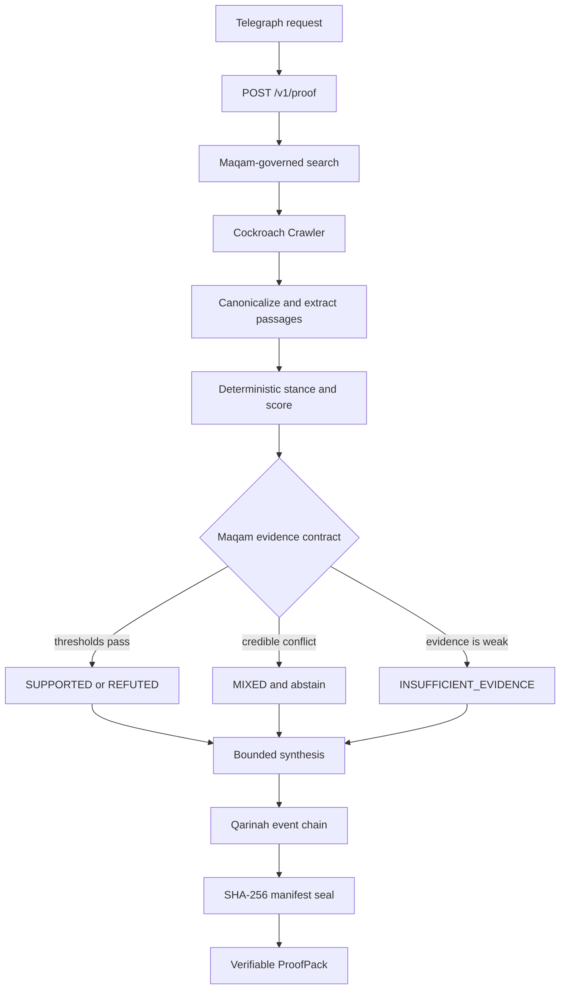

# Qarinah ProofPack

**Evidence-backed intelligence for autonomous agents.**

[](https://github.com/AjnasNB/qarinah-proofpack/actions/workflows/ci.yml)
[](LICENSE)
[](telegraph/miner.yaml)

Autonomous agents should act on evidence, not plausible answers.

Qarinah ProofPack is a standalone [Telegraph](https://telegraphprotocol.com/) Miner and web application. It takes a factual claim or research question, gathers live public evidence, and returns a sealed machine contract with:

- a `SUPPORTED`, `REFUTED`, `MIXED`, or `INSUFFICIENT_EVIDENCE` verdict;
- calculated confidence and its complete component breakdown;
- supporting, refuting, neutral, and contradictory evidence records;
- canonical source URLs, retrieval times, and SHA-256 content hashes;
- a tamper-evident, in-memory Qarinah evidence-event chain;
- a Maqam evidence-policy decision and explicit abstention;
- an offline-verifiable manifest seal.

The differentiator is not a claim that our language model is smarter. ProofPack knows when the available evidence is too weak for an autonomous system to act.

> [!IMPORTANT]
> Hash verification proves pack integrity, evidence-record integrity, and Qarinah chain continuity. It does not cryptographically prove that a source is truthful. Source quality, diversity, relevance, agreement, and the Maqam policy determine whether the pack authorizes a decisive verdict.

## Why this is Telegraph-native

Telegraph routes requests by intent and historical Miner quality. ProofPack returns a structured intelligence signal that fits its Miner semantics directly:

```yaml
semantics:
  signal_mapping:
    confidence_field: confidence
    label_field: verdict
    reason_field: reason
  supported_intents:
    - FACT_CHECK
    - RESEARCH_SYNTHESIS
```

Telegraph answers: **which intelligence provider should receive this request?**

ProofPack answers: **is the resulting evidence strong enough for an agent to act?**

## System architecture



The production path is static-first and fail-closed:

1. Maqam governs anonymous Exa discovery with a bounded DuckDuckGo fallback.
2. Cockroach Crawler fetches only validated public HTTP(S) URLs with explicit origins, robots compliance, SSRF defenses, byte limits, request limits, and time budgets.
3. An optional external Cockroach Browser sidecar can render at most two eligible JavaScript failures. It is never bundled into this Apache-2.0 service.
4. Passage extraction, stance classification, and scoring are deterministic.
5. Maqam blocks decisive output when evidence fails the contract.
6. Optional LLM synthesis may make the answer easier to read. It cannot change the verdict or confidence.
7. Qarinah creates a new isolated event chain in memory. No upstream workspace ledger is discovered, read, or modified.
8. The service seals the complete payload and verifies it before returning HTTP 200.
9. If live acquisition is unavailable, the endpoint returns a valid sealed abstention pack instead of inventing an answer.

## Evidence contract

Confidence is calculated, never improvised by the synthesizer:

```text
confidence =
  0.35 × entailment
+ 0.20 × source diversity
+ 0.20 × evidence coverage
+ 0.15 × freshness
+ 0.10 × source agreement
```

The default Maqam policy applies these gates:

```text
coverage < 0.50              -> abstain
confidence < 0.55            -> abstain
independent sources < 2      -> abstain
material credible conflict   -> MIXED and abstain
insufficient decisive margin -> abstain
```

Single-source evidence also receives a confidence penalty before policy evaluation.

## API

### Create a proof

```http
POST /v1/proof
Content-Type: application/json

{
  "query": "Did the James Webb Space Telescope launch in 2021?",
  "intent": "FACT_CHECK",
  "request_id": "demo-jwst-001"
}
```

Only `query` is required. `query` accepts 3 to 2,048 normalized characters. The request schema is closed, so unknown fields are rejected.

Run it locally:

```bash
curl --request POST http://localhost:3000/v1/proof \
  --header "Content-Type: application/json" \
  --data '{"query":"Did the James Webb Space Telescope launch in 2021?","intent":"FACT_CHECK"}'
```

The complete response conforms to [`schemas/proofpack.v1.schema.json`](schemas/proofpack.v1.schema.json). Useful top-level fields include:

| Field | Meaning |
|---|---|
| `verdict` | Final evidence-policy label |
| `confidence` | Calculated score from 0 through 1 |
| `answer` | Concise synthesis constrained by the verdict |
| `coverage_score` | Fraction of material claim terms covered by relevant evidence |
| `freshness_score` | Evidence freshness weighted by relevance and quality |
| `conflict_score` | Strength of simultaneous support and refutation |
| `claims[]` | Claim-to-evidence links |
| `evidence[]` | Untrusted source passages, stances, quality signals, and hashes |
| `contradictions[]` | Explicit unresolved evidence conflicts |
| `policy` | Maqam thresholds, triggered rules, and decision |
| `qarinah` | Embedded evidence-event chain and head hash |
| `verification` | Manifest seal and chain metadata |
| `abstained` | Whether policy blocked a decisive answer |
| `reason` | Machine-readable signal reason mapped for Telegraph |

Inspect a compact view with `jq`:

```bash
curl --silent --request POST http://localhost:3000/v1/proof \
  --header "Content-Type: application/json" \
  --data '{"query":"Was Python first released in 1991?"}' \
  | jq '{verdict, confidence, coverage_score, freshness_score, conflict_score, abstained, reason, evidence_count: (.evidence | length), manifest_hash: .verification.manifest_hash}'
```

### Verify a pack

`POST /v1/verify` performs closed-contract validation, evidence-hash verification, manifest verification, event validation, Qarinah continuity checks, reference checks, and policy-invariant checks without network access.

```bash
curl --silent --request POST http://localhost:3000/v1/proof \
  --header "Content-Type: application/json" \
  --data '{"query":"Was Python first released in 1991?"}' \
  --output proofpack.json

curl --request POST http://localhost:3000/v1/verify \
  --header "Content-Type: application/json" \
  --data-binary @proofpack.json
```

Successful verification returns `valid: true` plus separate manifest, evidence, event-chain, and contract results. A modified pack returns HTTP 422 with precise error paths.

### Health

```http
GET /health
```

The proof and verification endpoints allow cross-origin POST requests, disable caching, reject oversized bodies, and return structured JSON errors.

## Quick start

Requirements:

- Node.js 22, 24, or 26;
- npm 10 or newer;
- outbound HTTPS for live search and public evidence pages.

```bash
git clone https://github.com/AjnasNB/qarinah-proofpack.git
cd qarinah-proofpack
npm ci
npm run dev
```

Open <http://localhost:3000>.

No API key is required for the default path.

### Optional environment variables

| Variable | Purpose |
|---|---|
| `PROOFPACK_PUBLIC_URL` | Canonical deployed HTTPS origin used by metadata and the Telegraph YAML renderer |
| `OPENAI_API_KEY` | Enables optional bounded answer synthesis through the OpenAI Responses API |
| `OPENAI_MODEL` | Required with `OPENAI_API_KEY`; chooses the synthesis model |
| `COCKROACH_BROWSER_ENDPOINT` | Base URL of a separately deployed Cockroach Browser daemon |
| `COCKROACH_BROWSER_TOKEN` | Bearer token for that optional browser daemon |

If either browser variable is missing, rendered fallback remains off. If either OpenAI variable is missing or synthesis fails, ProofPack uses its deterministic synthesizer.

## Verification and tests

```bash
npm run lint
npm run typecheck
npm test
npm run build
```

Or run the complete gate:

```bash
npm run check
```

The suite covers:

- query decomposition and canonical URL validation;
- Maqam-governed search routing and fallback;
- bounded crawling and optional browser recovery;
- deterministic evidence extraction and ranking;
- scoring, contradictions, policy thresholds, and abstention;
- canonical JSON and evidence hashing;
- Qarinah event creation, continuity, and semantic projection;
- tamper detection and closed-contract verification;
- request rate limiting;
- Telegraph YAML structure, semantics, hashing, and live-registry checks;
- complete end-to-end pipeline sealing.

CI runs the same gate on every push and pull request.

## Telegraph Miner

The committed [`telegraph/miner.yaml`](telegraph/miner.yaml) is a strict deployment template for Miner ID `717190`, slug `qarinah-proofpack`, and both supported intents. It deliberately contains one `${PROOFPACK_PUBLIC_URL}` token so a local URL can never be registered accidentally.

After deployment:

```powershell
$env:PROOFPACK_PUBLIC_URL = "https://qarinah-proofpack.vercel.app"
npm run check
node scripts/validate-telegraph.mjs --out telegraph/miner.rendered.yaml --official-source
```

The validator:

- checks the closed local YAML contract;
- confirms both intents remain canonical;
- detects live Miner ID or slug collisions;
- audits current official Telegraph YAML documentation;
- writes the exact registration bytes;
- prints the SHA-256 content hash and on-chain `bytes32` value.

Do not edit the rendered file after hashing it. See [`docs/TELEGRAPH-SUBMISSION.md`](docs/TELEGRAPH-SUBMISSION.md) for the signed-in schema sandbox, IPFS upload, Base Sepolia registration, activation, evidence capture, launch, and uptime runbook.

## Built on our open-source projects

ProofPack is a new isolated repository built from released packages. It does not patch, rewrite, or append to the upstream projects.

| Project | Release used | Role in ProofPack | License | Research archive |
|---|---:|---|---|---|
| [Qarinah](https://github.com/AjnasNB/qarinah) | `0.4.0` | Event envelopes, hash-linked provenance, stored-event verification | Apache-2.0 | [DOI 10.5281/zenodo.21547684](https://doi.org/10.5281/zenodo.21547684) |
| [Cockroach Crawler](https://github.com/AjnasNB/cockroach-crawler) | `0.7.0` | Robots-aware bounded web acquisition and source content hashes | MIT | [DOI 10.5281/zenodo.21851008](https://doi.org/10.5281/zenodo.21851008) |
| [Maqam](https://github.com/AjnasNB/maqam) | `0.3.3` | Governed source adapters, tool boundaries, evidence thresholds, abstention | MIT | [DOI 10.5281/zenodo.21851251](https://doi.org/10.5281/zenodo.21851251) |
| [Cockroach Browser](https://github.com/AjnasNB/cockroach-browser) | `0.4.1` sidecar protocol | Optional external rendering for bounded crawler failures | AGPL-3.0 | [DOI 10.5281/zenodo.21850760](https://doi.org/10.5281/zenodo.21850760) |

The browser sidecar is network-integrated only. Its AGPL source is not copied, linked, or distributed inside this Apache-2.0 repository.

## Trust and security boundaries

ProofPack treats every search result, page title, URL, page body, excerpt, and source-provided timestamp as untrusted data.

- Search and crawler content can never become a system instruction.
- Private-network destinations, credentials in URLs, and non-HTTP protocols are rejected.
- Static crawling uses explicit origins, bounded depth, robots compliance, byte limits, timeouts, and no retries.
- Browser fallback disables private-network access, cookies, downloads, and uploads for each new session.
- Optional LLM synthesis receives compact untrusted excerpts and a fixed verdict. It cannot set scores or policy.
- Qarinah provenance is generated in memory with `createEventEnvelope()` and `validateStoredEvent()` only.
- The service never discovers or appends to a filesystem Qarinah workspace.
- Every successful response self-verifies before it leaves the endpoint.
- Live network failure reduces authority to abstention.

Please report vulnerabilities privately as described in [`SECURITY.md`](SECURITY.md).

## Project layout

```text
app/                     Next.js application and public API routes
components/              Interactive proof console
docs/                    Telegraph release and submission runbook
lib/proof/               Acquisition, scoring, policy, provenance, and verifier
public/images/           Original generated visual direction assets
schemas/                 Closed ProofPack JSON Schema
scripts/                 Asset and Telegraph release validators
telegraph/               Miner YAML and strict local validator
test/                    Deterministic unit and integration tests
```

## Contributing

Issues and focused pull requests are welcome. Read [`CONTRIBUTING.md`](CONTRIBUTING.md), add tests for behavior changes, and preserve the fail-closed trust model.

## License

Qarinah ProofPack is licensed under [Apache-2.0](LICENSE). Third-party projects retain their own licenses.
